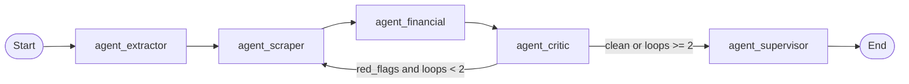
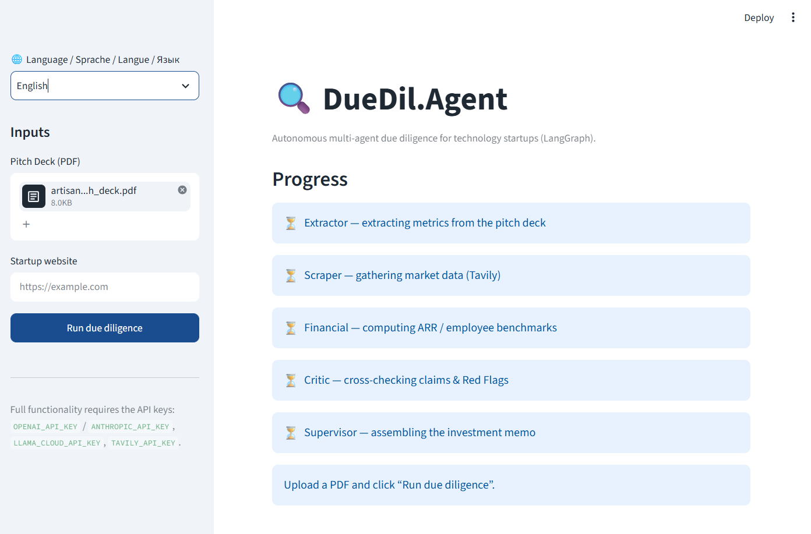

# DueDil.Agent

> Autonomous multi-agent **due-diligence** system for technology startups — built on LangGraph.

[](https://github.com/SergeyGer/duedil-agent/actions/workflows/ci.yml)
[](#testing--quality)
[](https://github.com/SergeyGer/duedil-agent/releases)
[](LICENSE)

[](https://www.python.org/)
[](https://github.com/langchain-ai/langgraph)
[](https://python.langchain.com/)
[](https://platform.openai.com/)
[](https://www.anthropic.com/)
[](https://streamlit.io/)
[](https://tavily.com/)
[](https://cloud.llamaindex.ai/)
[](https://www.reportlab.com/)
[](https://smith.langchain.com/)
[](https://pytest.org/)
[](https://github.com/astral-sh/ruff)

**DueDil.Agent** turns a raw pitch deck into a board-ready investment memo. You upload a
startup's PDF deck and its website URL; a graph of specialised LLM agents extracts the
claimed metrics, verifies them against live web data, benchmarks the financials, hunts for
inconsistencies (Red Flags) and writes a structured **Deal Memo** exported as PDF.

---

## Table of contents

- [Why](#why)
- [Key features](#key-features)
- [Architecture](#architecture)
  - [Graph topology](#graph-topology)
  - [Agents](#agents)
  - [Shared state (`VentureState`)](#shared-state-venturestate)
  - [Conditional routing & loop protection](#conditional-routing--loop-protection)
- [Tech stack](#tech-stack)
- [Project structure](#project-structure)
- [Getting started](#getting-started)
- [Configuration](#configuration)
- [Usage](#usage)
  - [CLI](#cli)
  - [Streamlit UI](#streamlit-ui)
  - [Python API](#python-api)
- [Output](#output)
- [Examples](#examples)
- [Testing & quality](#testing--quality)
- [Releasing](#releasing)
- [Design decisions](#design-decisions)
- [Limitations & roadmap](#limitations--roadmap)
- [Disclaimer](#disclaimer)
- [License](#license)

---

## Why

Manual first-pass due diligence is slow and inconsistent: an analyst re-reads the deck,
Googles the founders, checks competitors, sanity-checks the revenue figures and then writes
a memo. DueDil.Agent automates that first pass as a **deterministic, auditable graph** rather
than a single opaque prompt.

The design goal is to **never trust the deck**. Every claimed number is either corroborated
by external evidence or explicitly flagged. Agents are forbidden from inventing data — a
missing figure is reported as `[NOT_FOUND]` and becomes a Red Flag rather than a guess.

---

## Key features

- **Multi-agent orchestration** — five specialised nodes coordinated by LangGraph with a
  shared, typed state.
- **Critic feedback loop** — the Critic can send the graph back to the Scraper for a
  targeted second search, hard-capped at **2 iterations** (no runaway loops).
- **Live verification** — Tavily web search for competitors, traffic and founder footprint.
- **Financial benchmarking** — `ARR / headcount` vs. the B2B-SaaS norm (>$100k/employee).
- **Hybrid Red-Flag detection** — LLM reasoning **plus** deterministic rule-based checks
  (team-size mismatch, inflated "leadership" claims vs. near-zero traffic, missing ARR).
- **Professional PDF export** — Markdown memo rendered to a styled PDF via ReportLab.
- **Two front-ends** — a Streamlit web UI **and** a scriptable CLI.
- **Graceful degradation** — missing API keys or LLM failures fall back to a
  deterministic memo instead of crashing the graph.
- **Multilingual UI** — the Streamlit interface ships in English (default), German, French
  and Russian.
- **Observability** — one env var enables full LangSmith tracing.

---

## Architecture

### Graph topology



```
START -> agent_extractor -> agent_scraper -> agent_financial -> agent_critic
                                   ^                                   |
                                   |                        route_after_critic
                                   |  (flags and loops < 2)            |
                                   +-----------------------------------+
                                                                       |
                                        (clean or loops >= 2)          v
                                                      agent_supervisor -> END
```

### Agents

| Node | Module | Responsibility |
|------|--------|----------------|
| `agent_extractor` | `app/graph.py` | Reads `pitch_deck_raw`, extracts structured metrics via a strict prompt. Missing data becomes `[NOT_FOUND]`. Never invents numbers. |
| `agent_scraper` | `app/graph.py` | Uses Tavily to find the 3 main competitors, website traffic and founder/LinkedIn footprint. On a repeat pass, queries are driven by `critic_feedback`. |
| `agent_financial` | `app/graph.py` | Computes `ARR / team_size` and benchmarks it against the B2B-SaaS norm (>$100k). Emits a verdict. |
| `agent_critic` | `app/graph.py` | Cross-checks claims vs. market data (LLM **and** deterministic rules), accumulates Red Flags, increments `critic_loops_count`, produces the next search instruction. |
| `agent_supervisor` | `app/graph.py` | Assembles the final Markdown memo: Summary -> Metrics -> Market -> Financial audit -> Red Flags -> Recommendation (**INVEST / DEEP AUDIT / REJECT**). |

### Shared state (`VentureState`)

Defined in [`app/state.py`](app/state.py) as a `TypedDict`. Agents never chatter — they read
and return partial updates against this single source of truth.

| Field | Type | Description |
|-------|------|-------------|
| `pitch_deck_raw` | `str` | Full text extracted from the PDF. |
| `extracted_metrics` | `dict` | Structured metrics (name, ARR, team size, TAM, sector...). |
| `market_data` | `list[str]` | External search results (competitors, traffic, founders). |
| `financial_benchmarks` | `dict` | Computed ratios (ARR/employee) + market comparison. |
| `red_flags` | `list[str]` | Detected inconsistencies, hallucinations and business risks. |
| `critic_loops_count` | `int` | Number of Critic -> Scraper passes (max 2). |
| `final_memo` | `str` | Final Markdown memo. |
| `website_url`, `critic_feedback`, `progress_log`, `error` | — | Bookkeeping / observability fields. |

### Conditional routing & loop protection

```python
def route_after_critic(state) -> str:
    flags = state.get("red_flags") or []
    loops = state.get("critic_loops_count", 0)
    if flags and loops < MAX_CRITIC_LOOPS:   # MAX_CRITIC_LOOPS = 2
        return "agent_scraper"               # targeted re-search
    return "agent_supervisor"                # stop and write the memo
```

The loop is **hard-capped** at `MAX_CRITIC_LOOPS = 2`, guaranteeing termination.

---

## Tech stack

| Layer | Technology |
|-------|------------|
| Language | Python 3.11+ |
| Orchestration | LangGraph, LangChain Core/Community |
| LLMs | `gpt-4o` (OpenAI) / `claude-3-5-sonnet` (Anthropic) |
| Document parsing | LlamaParse (API) with a local `pypdf` fallback |
| Web search | Tavily |
| UI | Streamlit |
| Observability | LangSmith |
| Report export | ReportLab (Markdown -> PDF) |
| Testing / lint | pytest, pytest-cov, Ruff |

---

## Project structure

```
DueDil.Agent/
├── app/
│   ├── __init__.py        # package version
│   ├── state.py           # VentureState(TypedDict) + initial_state()
│   ├── config.py          # LLM factory (gpt-4o / claude-3-5-sonnet)
│   ├── prompts.py         # system prompts for Extractor / Critic / Supervisor
│   ├── tools.py           # Tavily search wrapper
│   ├── parser.py          # PDF -> Markdown (LlamaParse + pypdf fallback)
│   ├── graph.py           # agent nodes, graph assembly, routing, loop guard
│   ├── utils.py           # numeric parsing, benchmarks, heuristics
│   ├── report.py          # Markdown -> PDF (ReportLab)
│   ├── ui.py              # Streamlit web UI
│   └── cli.py             # command-line interface
├── tests/                 # pytest suite (70 tests, ~92% coverage)
├── data/                  # uploaded decks & generated reports (git-ignored)
├── assets/                # social-preview banner + UI screenshot
├── scripts/               # helper scripts (sample deck, coverage badge, banner)
├── .github/               # CI, release workflow, issue/PR templates
├── pyproject.toml         # metadata, entry point, pytest & ruff config
├── requirements.txt       # pinned lockfile (pip freeze)
├── env.example            # environment variable template
├── Makefile
└── README.md
```

---

## Getting started

### Prerequisites

- Python **3.11+**
- API keys: an LLM provider (OpenAI **or** Anthropic), plus LlamaParse and Tavily
  (the latter two are optional — the app degrades gracefully without them).

### Installation

```bash
git clone https://github.com/SergeyGer/duedil-agent.git
cd duedil-agent

python -m venv .venv
# Windows (PowerShell)
.\.venv\Scripts\Activate.ps1
# macOS / Linux
# source .venv/bin/activate

pip install -r requirements.txt
```

Or install as a package (provides the `duedil` console script):

```bash
pip install -e ".[dev]"
```

No pitch deck handy? Generate a synthetic one for testing:

```bash
python scripts/make_sample_deck.py   # -> data/sample_deck.pdf
```

---

## Configuration

Copy `env.example` to `.env` and fill in your keys:

```bash
# Windows
copy env.example .env
# macOS / Linux
cp env.example .env
```

| Variable | Required | Purpose |
|----------|----------|---------|
| `OPENAI_API_KEY` | one of | OpenAI key (for `gpt-4o`). |
| `ANTHROPIC_API_KEY` | one of | Anthropic key (for `claude-3-5-sonnet`). |
| `DUE_DIL_MODEL` | no | Model id. Default `gpt-4o`. |
| `LLAMA_CLOUD_API_KEY` | no | Enables high-quality PDF parsing. Falls back to `pypdf`. |
| `TAVILY_API_KEY` | no | Enables live web verification. |
| `LANGCHAIN_TRACING_V2` | no | `true` to enable LangSmith tracing. |
| `LANGCHAIN_API_KEY` | no | LangSmith API key. |
| `LANGCHAIN_PROJECT` | no | LangSmith project name. |

> **Windows note:** if the install path is long, enable *Long Paths*
> (`LongPathsEnabled=1`) so packages like `llama-index-core` install cleanly.

---

## Usage

### CLI

```bash
python -m app.cli deck.pdf https://startup.example
```

Options:

```
python -m app.cli <deck.pdf> [url] [options]

  -o, --out PATH     Output PDF path (default: data/<company>_memo.pdf)
      --md PATH      Also save the raw Markdown memo
      --json PATH    Dump the full final state as JSON
      --model ID     Override the LLM (e.g. claude-3-5-sonnet)
      --quiet        Only print the final memo
      --version      Show version and exit
```

Full example:

```bash
python -m app.cli pitch.pdf https://acme.ai \
    --model claude-3-5-sonnet \
    --out reports/acme.pdf \
    --md reports/acme.md \
    --json reports/acme.json
```

### Streamlit UI

```bash
streamlit run app/ui.py
```

Upload a PDF, paste the website URL, and watch the **step-by-step agent progress** as the
graph streams events. The memo renders in Markdown with a **Download PDF** button.

The interface is available in **English (default), German, French and Russian** — pick the
language in the sidebar. Translations live in [`app/i18n.py`](app/i18n.py).



### Python API

```python
from app.parser import parse_pdf_to_markdown
from app.graph import run_due_diligence
from app.report import markdown_to_pdf

deck_text = parse_pdf_to_markdown("deck.pdf")
state = run_due_diligence(deck_text, website_url="https://acme.ai")

print(state["financial_benchmarks"]["verdict"])
for flag in state["red_flags"]:
    print("RED FLAG:", flag)

markdown_to_pdf(state["final_memo"], "memo.pdf")
```

---

## Output

The supervisor produces a Markdown memo; the same content is exported to a styled **PDF**
(`data/<company>_memo.pdf`):

```markdown
# Investment Memo — Acme AI

## 1. Executive Summary
First-pass automated due diligence for Acme AI (B2B SaaS).

## 2. Startup Metrics
- ARR: $1.2M  |  Team: 10  |  TAM: $10B

## 4. Financial Audit
Healthy: ARR/employee of $120,000 exceeds the B2B SaaS benchmark of $100,000.

## 5. Hidden Risks (Red Flags)
- Claimed leadership but external traffic is near zero.

## 6. Final Recommendation
**DEEP AUDIT**
```

---

## Examples

Ready-made inputs and outputs live in [`examples/`](examples/):

| File | Description |
|------|-------------|
| [`sample_deck.pdf`](examples/sample_deck.pdf) | Synthetic pitch deck (NimbusAI). Regenerate with `python scripts/make_sample_deck.py`. |
| [`sample_memo.md`](examples/sample_memo.md) | The generated deal memo (Markdown). |
| [`sample_memo.pdf`](examples/sample_memo.pdf) | The same memo exported to PDF. |
| [`sample_memo.json`](examples/sample_memo.json) | The full final `VentureState` (metrics, market data, benchmarks, red flags). |

Regenerate the whole set with a single command:

```bash
python -m app.cli examples/sample_deck.pdf https://nimbusai.example \
    --out examples/sample_memo.pdf --md examples/sample_memo.md --json examples/sample_memo.json
```

The sample run trips several **Red Flags** (a "market-leader" claim unsupported by external
traffic, a team-size discrepancy vs. LinkedIn, and an ARR/employee below the SaaS benchmark) —
a good illustration of the critic loop at work.

---

## Testing & quality

```bash
pytest            # run the suite
make cov          # tests + coverage report
make lint         # ruff check
make fmt          # ruff format
```

The suite (70 tests, ~92% line coverage of `app/`) covers numeric parsing, financial
benchmarking, Red-Flag heuristics, the routing function, full graph execution with a fake
LLM, the parser fallback, the Tavily wrapper and the CLI — all **offline**, no API keys or
network required.

CI runs the tests (with coverage) and Ruff on every push/PR. The coverage badge above is
generated locally and committed automatically by the
[`coverage` workflow](.github/workflows/coverage.yml) — no third-party service required.

---

## Releasing

Releases are fully automated from Git tags — see
[`.github/workflows/release.yml`](.github/workflows/release.yml).

1. Bump `version` in `pyproject.toml` and add a `CHANGELOG.md` entry.
2. Commit and push to `main`.
3. Create and push an annotated tag:

```bash
git tag -a v0.2.0 -m "Release v0.2.0"
git push origin v0.2.0
```

The workflow then:

- verifies the tag matches `pyproject.toml`'s `version` (fails otherwise),
- builds the sdist and wheel (`python -m build`),
- creates a **GitHub Release** with auto-generated notes and the distribution attached.

Tags containing `-rc`, `-beta` or `-alpha` are marked as **pre-releases**.

### Optional: publishing to PyPI

PyPI publishing is opt-in and uses [Trusted Publishing](https://docs.pypi.org/trusted-publishers/)
(OIDC — no long-lived token):

1. Configure a Trusted Publisher on PyPI for this repository and the `pypi` environment.
2. Add a repository **variable** `PUBLISH_TO_PYPI` = `true`
   (*Settings → Secrets and variables → Actions → Variables*).
3. Push a tag — the `publish-pypi` job uploads the distribution automatically.

---

## Design decisions

- **Sequential Extractor -> Scraper** — the Scraper needs the company name and sector from
  the Extractor to build meaningful queries, so the two are not parallelised.
- **Hybrid critic** — LLM judgement is powerful but non-deterministic; deterministic rules
  guarantee that obvious contradictions are always caught.
- **Loop guard** — `MAX_CRITIC_LOOPS = 2` prevents infinite Critic <-> Scraper cycles.
- **Graceful degradation** — every LLM/search call is wrapped so a missing key or a failed
  request yields a fallback memo rather than a crash.
- **Separation of rendering** — the graph emits Markdown; PDF generation lives in
  `report.py`, keeping the graph testable without ReportLab.

---

## Limitations & roadmap

- Output quality depends on the quality of external search results (and on the LLM).
- Numbers are parsed heuristically from prose; unusual formats may need manual review.
- The memo is a **first-pass** artefact — not a substitute for human diligence.

**Roadmap:** parallel competitor/founder scraping; caching of search results; per-sector
benchmarks; multi-deck batch mode; evaluation harness with golden memos.

---

## Disclaimer

DueDil.Agent is an **automated analysis tool**. Its output is generated by LLMs and web
search and may contain errors or omissions. It does **not** constitute investment advice.
Always verify findings independently before making any investment decision.

---

## License

Released under the [MIT License](LICENSE).

## Contributing

Contributions are welcome — see [CONTRIBUTING.md](CONTRIBUTING.md). By participating you
agree to abide by our [Code of Conduct](CODE_OF_CONDUCT.md). Please report security issues
privately as described in [SECURITY.md](SECURITY.md).
