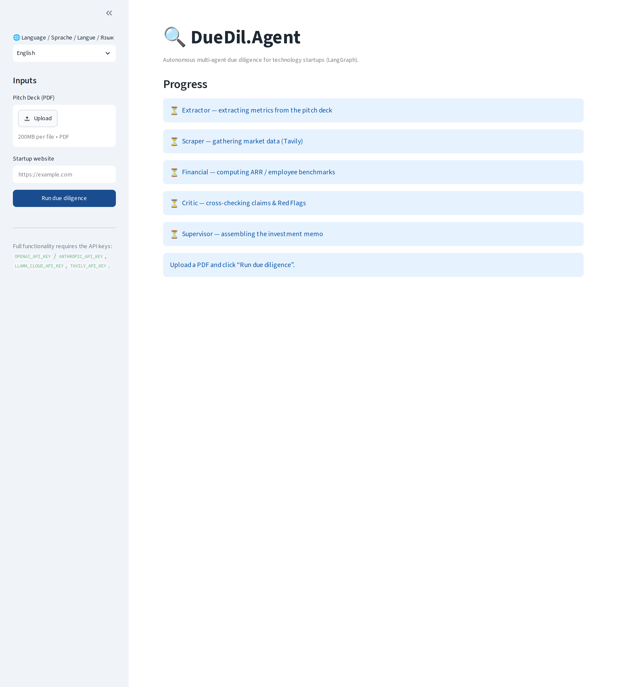
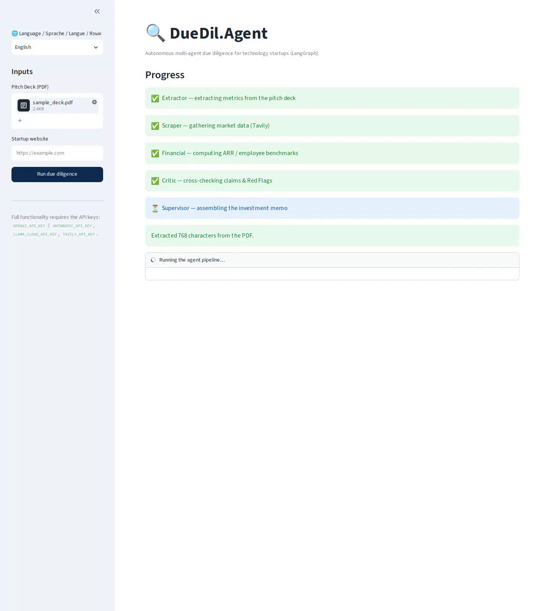
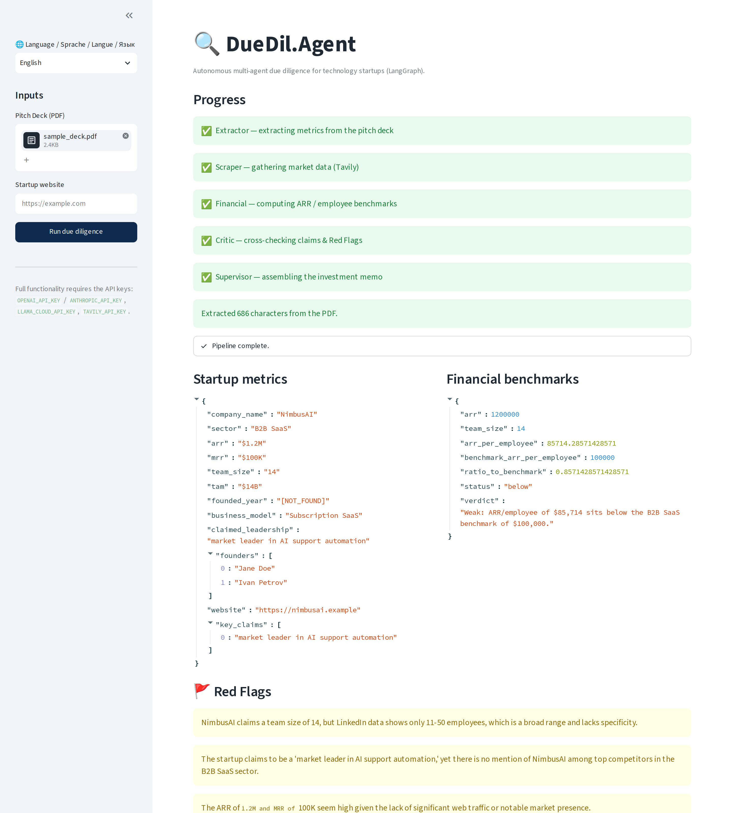
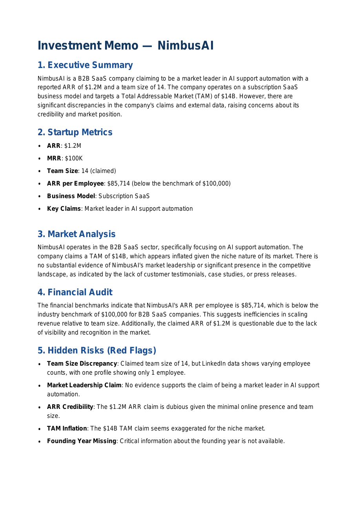

# DueDil.Agent

> **An autonomous due-diligence analyst.** Feed it a startup's pitch deck and website; five
> specialised AI agents verify every claim against live web data and produce a board-ready
> investment memo — in minutes, with the evidence trail attached.

[](https://github.com/SergeyGer/duedil-agent/actions/workflows/ci.yml)
[](https://github.com/SergeyGer/duedil-agent/security/code-scanning)
[](#engineering-standards)
[](https://github.com/SergeyGer/duedil-agent/releases)
[](LICENSE)

[](https://www.python.org/)
[](https://github.com/langchain-ai/langgraph)
[](https://platform.openai.com/)
[](https://streamlit.io/)
[](Dockerfile)

---

## See it work

A real run on a sample pitch deck — five agents, two passes of critical re-verification, and a
memo that ends in **REJECT** because the deck does not survive scrutiny:

<video src="docs/media/demo-offline.mp4" controls width="820"></video>

[▶ watch the 25-second walkthrough](docs/media/demo-offline.mp4) ·
[the same pipeline against real APIs (47 s)](docs/media/demo-live.mp4)

| Upload a deck | Agents work through it | Out comes the memo |
|---|---|---|
|  |  |  |

---

## The problem it solves

First-pass due diligence is slow, repetitive and inconsistent: read the deck, search the
founders, check the competitors, sanity-check the revenue, write the memo — and two analysts
produce two different memos from the same deck.

The expensive part is not the writing. **It is that nothing in the deck is verified.**

DueDil.Agent automates that first pass as a deterministic pipeline instead of one opaque
prompt. Its guiding rule: *never trust the deck*. Every number is either corroborated by
external evidence or explicitly flagged — a missing figure is reported as `[NOT_FOUND]`, never
guessed.

| | Manual first pass | DueDil.Agent |
|---|---|---|
| Time to a written memo | 2–4 hours | ~2 minutes |
| Evidence behind each claim | In the analyst's head | Quoted in the artefact, with the source data attached |
| Consistency between analysts | Varies | Same pipeline, same rules, same output shape |
| Obvious contradictions | Missed when tired | Caught by deterministic rules, every time |
| Cost per review | Analyst hours | Cents of model and search calls |

---

## What it does

**Five specialised agents, one deterministic pipeline**

1. **Extractor** — reads the deck and pulls out the claimed metrics.
2. **Scraper** — searches the live web: competitors, traffic, founder footprint.
3. **Financial** — benchmarks `ARR / headcount` against the B2B-SaaS norm.
4. **Critic** — cross-checks every claim and hunts for Red Flags.
5. **Supervisor** — writes the memo and the recommendation.

**What makes the result trustworthy**

- **Hybrid Red-Flag detection** — LLM judgement *plus* deterministic rules that cannot be
  talked out of a contradiction.
- **Bounded self-correction** — the Critic can send the graph back for a targeted second
  search, hard-capped so cost and runtime stay predictable.
- **Graceful degradation** — a missing key or a failed call narrows the analysis instead of
  breaking the run.
- **Deterministic fallback** — with no model reachable at all, it still produces a memo.

**The deliverable** is a structured memo — executive summary, metrics, market analysis,
financial audit, Red Flags, and a recommendation of `INVEST` / `DEEP AUDIT` / `REJECT` —
exported as a styled PDF, with the complete evidence trail available as JSON.



---

## Try it in one command

```bash
git clone https://github.com/SergeyGer/duedil-agent.git
cd duedil-agent
docker compose up --build        # → http://localhost:8501
```

No API keys? The interface still works and the pipeline still runs — it degrades to the
deterministic mode and says so. To see the full agent behaviour with zero cost and no network:

```bash
make demo                        # offline run: the real graph, canned model and search
```

Prefer Python? `pip install -r requirements.txt`, then either
`streamlit run app/ui.py` or `python -m app.cli deck.pdf https://startup.example`.
Full instructions: [Installation & Deployment](https://github.com/SergeyGer/duedil-agent/wiki/Installation-and-Deployment).

---

## Engineering standards

This is a portfolio project, so it is built the way production software is built — not as a
notebook that happens to run.

| Practice | How it shows up here |
|---|---|
| **Tested behaviour** | **79 automated tests, 90 % line coverage**, runnable offline in ~6 seconds; CI fails below 88 % |
| **Static analysis** | **CodeQL** (`security-and-quality`) on every push, PR and weekly — [zero open alerts](https://github.com/SergeyGer/duedil-agent/security/code-scanning) |
| **Continuous integration** | Every PR runs the tests on **Python 3.11, 3.12 and 3.13**, plus linting, formatting and pre-commit hygiene checks |
| **Protected delivery** | `main` requires a pull request plus passing status checks; releases are tag-driven and verify that the tag matches the package version |
| **Supply-chain discipline** | Every GitHub Action pinned to a commit SHA; Dependabot keeps them current weekly |
| **Reproducibility** | Pinned lockfile, multi-stage Docker image, non-root runtime user, container healthcheck |
| **Documentation as code** | The project ships a technical wiki, a reproducible offline demo, and a scripted screenshot/video capture |
| **Honest engineering** | Known limits, failure modes and the one accepted upstream advisory are documented rather than hidden |

---

## Under the hood, briefly

A **LangGraph** pipeline of five nodes sharing one typed state. The Critic sits in a feedback
loop that can request a targeted re-verification, capped at two passes so a run always
terminates. Red Flags come from two independent sources — an LLM critic and deterministic
heuristics — so an obvious contradiction is caught even on a bad model day. Every external
dependency (model, PDF parser, web search) is optional and degrades gracefully.

```
deck.pdf → Extractor → Scraper → Financial → Critic ⇄ Scraper (≤ 2 passes) → Supervisor → memo
```

| | |
|---|---|
| **Orchestration** | LangGraph, LangChain |
| **Models** | `gpt-4o` (OpenAI) · `claude-3-5-sonnet` (Anthropic) |
| **Document parsing** | LlamaParse, with a local `pypdf` fallback |
| **Live verification** | Tavily web search |
| **Interfaces** | Streamlit (4 languages) · CLI · Python API |
| **Export** | ReportLab (Markdown → styled PDF) |
| **Observability** | LangSmith tracing, one environment variable |
| **Packaging** | Docker + Docker Compose, pinned `pip` lockfile |

The technical reference — architecture, the Red-Flag rule set with its exact thresholds,
configuration, deployment, design rationale and troubleshooting — lives in the
**[Engineering Wiki](https://github.com/SergeyGer/duedil-agent/wiki)**.

---

## Where to go next

| I want to… | Go to |
|---|---|
| Understand the product and its value | [Product Overview](https://github.com/SergeyGer/duedil-agent/wiki/Product-Overview) |
| Review the architecture and state machine | [Architecture](https://github.com/SergeyGer/duedil-agent/wiki/Architecture) |
| See exactly how a Red Flag is raised | [Red-Flag Engine](https://github.com/SergeyGer/duedil-agent/wiki/Red-Flag-Engine) |
| Run, deploy or extend it | [Installation](https://github.com/SergeyGer/duedil-agent/wiki/Installation-and-Deployment) · [Configuration](https://github.com/SergeyGer/duedil-agent/wiki/Configuration) · [Extending](https://github.com/SergeyGer/duedil-agent/wiki/Extending-the-System) |
| Read the quality and security posture | [Testing & Quality Gates](https://github.com/SergeyGer/duedil-agent/wiki/Testing-and-Quality-Gates) · [Security & Limits](https://github.com/SergeyGer/duedil-agent/wiki/Security-and-Limits) |
| Understand the trade-offs | [Design Decisions](https://github.com/SergeyGer/duedil-agent/wiki/Design-Decisions) |
| Fix something that broke | [Troubleshooting](https://github.com/SergeyGer/duedil-agent/wiki/Troubleshooting) |

Ready-made inputs and outputs live in [`examples/`](examples): the synthetic pitch deck, the
generated memo as Markdown and PDF, and the full state JSON behind it.

---

## Roadmap

- [ ] Parallel competitor and founder scraping (the three searches are independent today)
- [ ] Per-sector financial benchmarks instead of a single SaaS norm
- [ ] Caching of search results across runs
- [ ] Multi-deck batch mode with a portfolio-level summary
- [ ] An evaluation harness with golden memos to track analysis quality over time

---

## Disclaimer

DueDil.Agent is an **automated analysis tool**. Its output is generated by LLMs and web search
and may contain errors or omissions. It does **not** constitute investment advice. Always verify
findings independently before making any investment decision.

Released under the [MIT License](LICENSE) · Contributions welcome — see
[CONTRIBUTING.md](CONTRIBUTING.md) · Security issues: [SECURITY.md](SECURITY.md)
