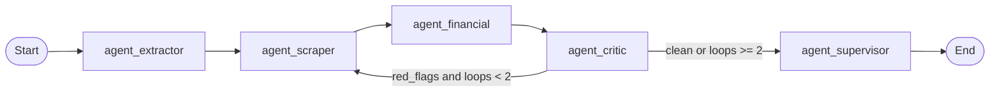
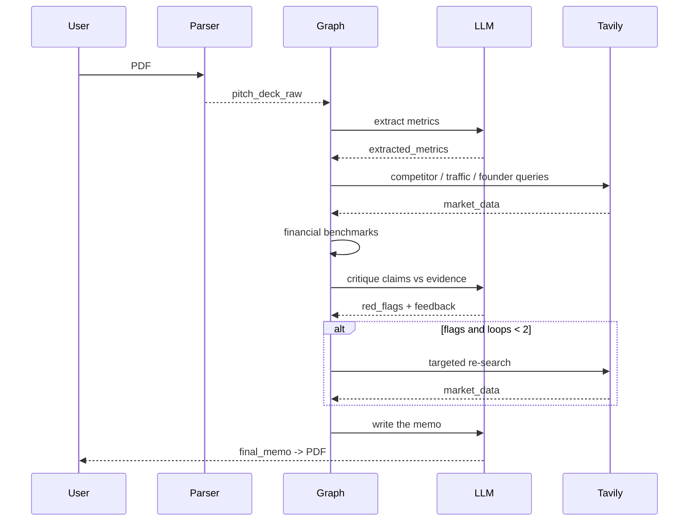

# Architecture

DueDil.Agent is a five-node [LangGraph](https://github.com/langchain-ai/langgraph) pipeline
with a bounded critic feedback loop. Every node reads and writes a single typed state object
(`VentureState`); nodes never call each other directly.

> For the high-level overview see the [README](../README.md#architecture).

## High-level flow



```
INPUT: pitch deck PDF + website URL
  |
  v
[1] Extractor  -> extracted_metrics        (structured claims; [NOT_FOUND] when absent)
  |
  v
[2] Scraper    -> market_data              (Tavily: competitors, traffic, founders)
  |
  v
[3] Financial  -> financial_benchmarks     (ARR / headcount vs. $100k SaaS benchmark)
  |
  v
[4] Critic     -> red_flags, critic_feedback, critic_loops_count
  |                |
  |  flags & < 2   |   clean or >= 2
  +-----> [2]      +-----> [5] Supervisor -> final_memo -> PDF
```

## Module map

| Module | Responsibility |
|--------|----------------|
| `app/state.py` | `VentureState` (`TypedDict`) and `initial_state()` |
| `app/config.py` | LLM factory (`gpt-4o` / `claude-*`), lazily constructed |
| `app/prompts.py` | System prompts for the extractor, critic and supervisor |
| `app/tools.py` | Tavily search tool (`langchain-tavily`, community fallback) |
| `app/parser.py` | PDF → Markdown (LlamaParse, `pypdf` fallback) |
| `app/graph.py` | Agent nodes, routing, graph assembly, loop guard |
| `app/utils.py` | Numeric parsing, financial benchmarks, Red-Flag heuristics |
| `app/report.py` | Markdown → PDF rendering (ReportLab) |
| `app/i18n.py` | UI translations (EN / DE / FR / RU) |
| `app/cli.py`, `app/ui.py` | Front-ends |

---

## Shared state

`VentureState` is a `TypedDict`. Each node returns a *partial* dict that LangGraph merges into
the running state, so nodes stay decoupled.

| Field | Type | Written by | Notes |
|-------|------|-----------|-------|
| `pitch_deck_raw` | `str` | CLI / UI | Markdown extracted from the deck |
| `website_url` | `str` | CLI / UI | Optional |
| `extracted_metrics` | `dict` | Extractor | Claims as strings; `[NOT_FOUND]` when absent |
| `market_data` | `list[str]` | Scraper | Raw search blocks (replaced on each pass) |
| `financial_benchmarks` | `dict` | Financial | Ratios + human-readable verdict |
| `red_flags` | `list[str]` | Critic | Accumulated and de-duplicated across passes |
| `critic_loops_count` | `int` | Critic | Incremented on every pass |
| `critic_feedback` | `str` | Critic | Drives the next Scraper query |
| `final_memo` | `str` | Supervisor | Markdown deal memo |
| `progress_log` | `list[str]` | all nodes | Uses an `Annotated[..., add]` reducer |

---

## Nodes

### 1. `agent_extractor` (`app/graph.py`)

- **In:** `pitch_deck_raw`.
- **Out:** `extracted_metrics`.
- **How:** a single LLM call with `EXTRACTOR_SYSTEM`, then defensive JSON parsing
  (`_safe_json` tolerates code fences and stray prose). The prompt forbids inventing data —
  any field that is not explicitly stated must be `"[NOT_FOUND]"`.

### 2. `agent_scraper` (`app/graph.py`)

- **In:** `extracted_metrics`, `critic_feedback`, `critic_loops_count`.
- **Out:** `market_data`.
- **How:** builds 3 default queries (competitors / traffic / founders+team) or, on a repeat
  pass, targets `critic_feedback`. Results are flattened by `stringify_search_results`.
- **Degrades:** if `TAVILY_API_KEY` is missing or the tool cannot be built, it records a
  placeholder instead of failing.

### 3. `agent_financial` (`app/graph.py`)

- **In:** `extracted_metrics`.
- **Out:** `financial_benchmarks`.
- **How:** pure Python (`app/utils.py`) — parses `arr` and `team_size` (`"$1.2M"`, `"50"`,
  `"10k"` …), computes `ARR / employee` and compares it against `DEFAULT_ARR_PER_EMPLOYEE_BENCHMARK`
  ($100k). Unknown inputs produce an explicit "insufficient data" verdict.

### 4. `agent_critic` (`app/graph.py`)

- **In:** `extracted_metrics`, `market_data`.
- **Out:** `red_flags`, `critic_feedback`, `critic_loops_count`.
- **How:** an LLM pass (`CRITIC_SYSTEM`) **plus** deterministic guards (`_deterministic_flags`):
  - team-size mismatch (deck says 50, external sources say 2),
  - leadership claim vs. near-zero website traffic,
  - missing ARR.
  Flags are appended to any existing ones and de-duplicated.

### 5. `agent_supervisor` (`app/graph.py`)

- **In:** the whole state.
- **Out:** `final_memo`.
- **How:** renders a context block (metrics + benchmarks + market data + flags) and asks the
  LLM for a Markdown memo following a fixed outline. If the call fails, `_fallback_memo`
  produces a deterministic memo with a rule-based recommendation.

---

## Routing & loop protection

The only conditional edge sits after the critic:

```python
def route_after_critic(state) -> str:
    flags = state.get("red_flags") or []
    loops = state.get("critic_loops_count", 0)
    if flags and loops < MAX_CRITIC_LOOPS:   # MAX_CRITIC_LOOPS = 2
        return "agent_scraper"               # targeted re-search
    return "agent_supervisor"                # stop and write the memo
```

The loop is **hard-capped at 2 passes**, which guarantees termination even if the critic
keeps finding problems. The first pass is a broad sweep; the second is targeted at
`critic_feedback`.

## Sequence



## Design decisions

- **Sequential Extractor → Scraper.** The scraper needs the company name and sector, so the
  two cannot run in parallel.
- **Hybrid critic.** LLM judgement is nuanced but non-deterministic; rule-based guards make
  sure the obvious contradictions are always caught.
- **Lazy LLM construction.** `get_llm()` is called inside each node's `try`, so a missing key
  degrades to the fallback memo instead of crashing the graph — which also keeps the test
  suite offline.
- **Rendering is separate.** The graph emits Markdown; `app/report.py` turns it into a PDF.
- **Determinism where it matters.** Parsing numbers, benchmarking and the loop counter are
  pure functions in `app/utils.py`, fully unit-tested.

## Extension points

| Goal | Where |
|------|-------|
| Add a node | Define it in `app/graph.py`, `add_node(...)`, wire the edges |
| Change the benchmark | `DEFAULT_ARR_PER_EMPLOYEE_BENCHMARK` in `app/utils.py` |
| Change the pass cap | `MAX_CRITIC_LOOPS` in `app/graph.py` |
| Swap the LLM | `DUE_DIL_MODEL` env var, or `app/config.py` |
| Add a language | `TRANSLATIONS` in `app/i18n.py` (tests enforce key parity) |
| Adjust prompts | `app/prompts.py` |

## Testing strategy

All tests run **offline** (no API keys, no network):

- `test_graph.py` — full graph execution with `FakeListChatModel`, routing and the loop cap.
- `test_critic.py`, `test_utils.py` — deterministic heuristics and benchmarking.
- `test_parser.py`, `test_report.py`, `test_tools.py`, `test_config.py` — I/O edges with
  monkeypatched dependencies.
- `test_cli.py` — the CLI against a fake graph.
- `test_i18n.py`, `test_ui.py` — translation parity and a Streamlit smoke test (`AppTest`).

Coverage is measured with `pytest-cov` and enforced at 88% (`[tool.coverage.report]`).
