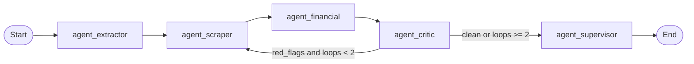

# Architecture

## Graph topology



Five nodes, one conditional edge, one cycle with a hard cap.

## Why a graph instead of an agent loop

| Property | Single ReAct-style loop | This graph |
|---|---|---|
| Cost predictability | Unknown number of LLM calls | Bounded: ≤ 2 critic passes, so ≤ 11 LLM calls |
| Testability | The whole system is one unit | Every node is a pure-ish function over the state |
| Auditability | A transcript | A typed state with a `progress_log` per node |
| Failure isolation | One bad step poisons the run | Each node catches its own failure and degrades |
| Termination | Depends on the model | Guaranteed by `MAX_CRITIC_LOOPS` |

The trade-off: the pipeline is less flexible than a free-running agent. That is deliberate — a
due-diligence artefact has to be reproducible and explainable to a third party.

## Nodes

| Node | Module | Responsibility | Failure behaviour |
|---|---|---|---|
| `agent_extractor` | `app/graph.py` | Reads `pitch_deck_raw`, extracts structured metrics with a strict prompt. | On LLM failure: empty metrics + `[extractor] FAILED` in the log; the rest of the graph still runs. |
| `agent_scraper` | `app/graph.py` | Tavily search for competitors, traffic and founder footprint. On a repeat pass, queries come from `critic_feedback`. | No key → a single `[market_data unavailable: …]` block; per-query errors are captured inline. |
| `agent_financial` | `app/graph.py` | `ARR / headcount` vs. the benchmark; emits `status` and a `verdict` sentence. | Pure computation, no external calls; missing inputs yield "insufficient data". |
| `agent_critic` | `app/graph.py` | LLM cross-check **plus** deterministic rules; accumulates Red Flags, increments `critic_loops_count`, writes the next search instruction. | LLM failure keeps the deterministic flags and records `critic failed: …` as feedback. |
| `agent_supervisor` | `app/graph.py` | Assembles the final Markdown memo from the whole state. | Empty or failed LLM response → deterministic `_fallback_memo()`. |

Per-node contracts, prompts and the sequence diagram are also summarised in
[`docs/architecture.md`](https://github.com/SergeyGer/duedil-agent/blob/main/docs/architecture.md).

## Shared state (`VentureState`)

Agents never talk to each other. They read and return partial updates against one typed
dictionary — the single source of truth.

| Field | Type | Written by | Meaning |
|---|---|---|---|
| `pitch_deck_raw` | `str` | input | Full text extracted from the PDF. |
| `website_url` | `str` | input | Startup URL, used for search and as a metric fallback. |
| `extracted_metrics` | `dict` | extractor | Structured claims (all values strings by design). |
| `market_data` | `list[str]` | scraper | Raw external evidence blocks, one per query. |
| `financial_benchmarks` | `dict` | financial | Ratios, benchmark, `status`, `verdict`. |
| `red_flags` | `list[str]` | critic | Accumulated findings; deduplicated across passes. |
| `critic_loops_count` | `int` | critic | Number of critic→scraper passes. |
| `critic_feedback` | `str` | critic | Instruction that drives the next scraper pass. |
| `final_memo` | `str` | supervisor | The deliverable, in Markdown. |
| `progress_log` | `Annotated[list[str], add]` | all nodes | Append-only trace; the reducer is why nodes cannot clobber each other. |
| `error` | `str` | any | Reserved for surfaced failures. |

Two deliberate choices:

- **Strings, not numbers, for metrics.** The deck says `$1.2M`, `12-15`, `about 20`. Parsing
  happens once, in `app/utils.py`, where the heuristics are unit-tested — not scattered across
  nodes.
- **`progress_log` uses the `add` reducer**, so LangGraph merges concurrent appends instead of
  overwriting. It is also what the UI and CLI stream to the user.

## Conditional routing and the loop guard

```python
MAX_CRITIC_LOOPS = 2

def route_after_critic(state) -> str:
    flags = state.get("red_flags") or []
    loops = state.get("critic_loops_count", 0)
    if flags and loops < MAX_CRITIC_LOOPS:
        return "agent_scraper"      # targeted re-search
    return "agent_supervisor"       # stop and write the memo
```

Why two passes and not one or "until clean":

- **One pass** gives the critic no way to act on its own findings: it can only complain about
  the evidence the first search happened to return.
- **"Until clean"** does not terminate. A critic that always finds something new will loop
  forever, and each iteration costs tokens and latency.
- **Two passes** means the second search is *targeted*: `critic_feedback` names the missing
  evidence, so the scraper queries what is actually disputed.

Worst case cost is therefore fixed: `1 extractor + 3 scraper queries × 2 + 2 critic + 1
supervisor` LLM calls, plus the search calls.

## Execution modes

| Mode | Entry point | Streams |
|---|---|---|
| Streamlit UI | `app/ui.py` | `graph.stream(..., stream_mode="updates")`, one progress chip per node |
| CLI | `app/cli.py` | the same stream, printed as `done <node>` lines |
| Library | `run_due_diligence(text, url)` | `graph.invoke(...)`, returns the final state |

All three share `build_graph()`; the tests exercise the same object with a fake LLM.

## Data flow at a glance

```
deck.pdf ──(parse_pdf_to_markdown)──► pitch_deck_raw
                                          │
                              ┌───────────┴────────────┐
                              ▼                        ▼
                      extracted_metrics ──► financial_benchmarks
                              │                        │
                              ▼                        │
                   market_data (Tavily)                │
                              │                        │
                              └────────► red_flags ◄───┘
                                          │
                                          ▼
                                     final_memo ──(markdown_to_pdf)──► memo.pdf
```

## Module map

| Module | Lines | Responsibility |
|---|---|---|
| `app/graph.py` | ~445 | Nodes, graph assembly, routing, loop guard, fallback memo. |
| `app/state.py` | ~70 | `VentureState` / `ExtractedMetrics` typed dicts, `initial_state()`. |
| `app/config.py` | ~45 | Lazy LLM factory (`gpt-4o` / `claude-3-5-sonnet`), cached per (model, temperature). |
| `app/prompts.py` | ~110 | System prompts for Extractor, Critic, Supervisor. |
| `app/parser.py` | ~90 | PDF → Markdown (LlamaParse, `pypdf` fallback), bytes or path input. |
| `app/tools.py` | ~70 | Tavily wrapper (`langchain-tavily`, community fallback) + result stringifier. |
| `app/utils.py` | ~180 | Numeric parsing, team/traffic extraction, benchmark computation, `is_missing`. |
| `app/report.py` | ~250 | Markdown → PDF (ReportLab): headings, lists, tables, quotes, inline markup. |
| `app/ui.py` | ~160 | Streamlit UI, i18n wiring, progress rendering, PDF download. |
| `app/i18n.py` | ~200 | EN / DE / FR / RU translation tables. |
| `app/cli.py` | ~180 | Argument parsing, streaming output, PDF/MD/JSON artefacts. |
| `app/streamlit_app.py` | ~25 | Docker entry point (`DUEDIL_MODE=ui` or `demo-ui`). |

≈1850 lines of application code, ≈800 lines of tests, ≈930 lines of tooling and demo scripts.
